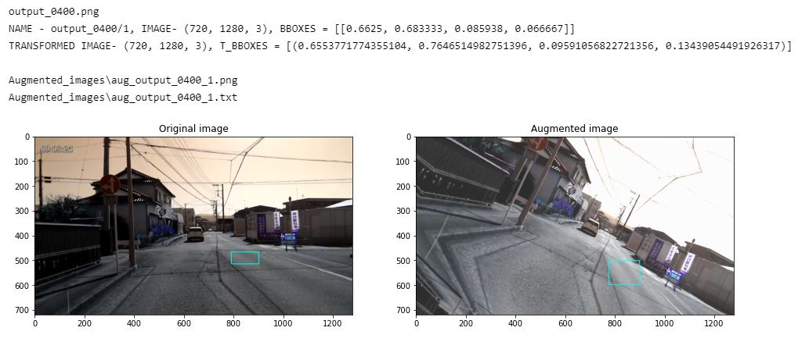

# Image Augmentation using *Albumentations*

source: [Albumentations Documentation](https://albumentations.ai/docs/)

The code reads the image and YOLO annotation txt file from the Original_images folder, and perform image augmentation based on an augmentation pipeline, and writes the augmented image and its annotation file in the Augmented_images folder. It also has functions to visualize the augmented images and its annotation files.

Different augmentation pipeline can be used based on your work using the source mentioned above.

